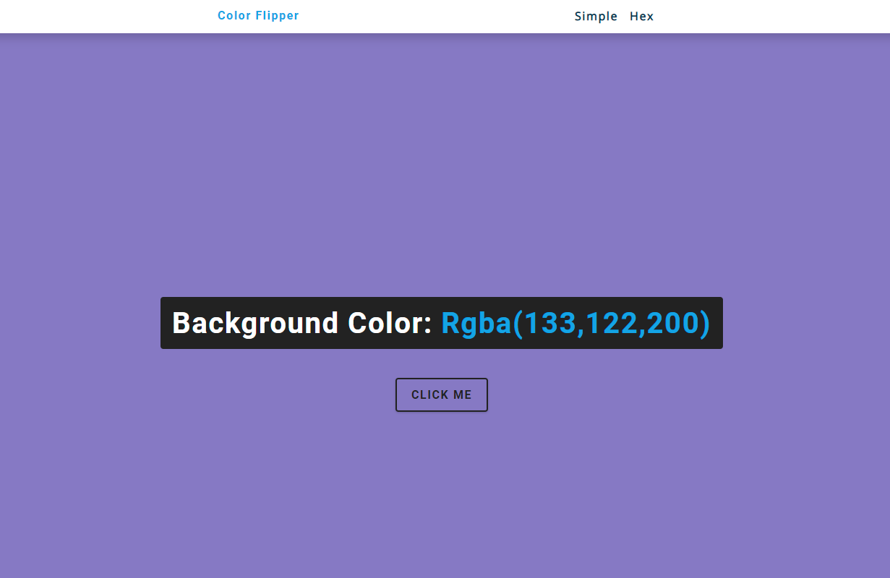
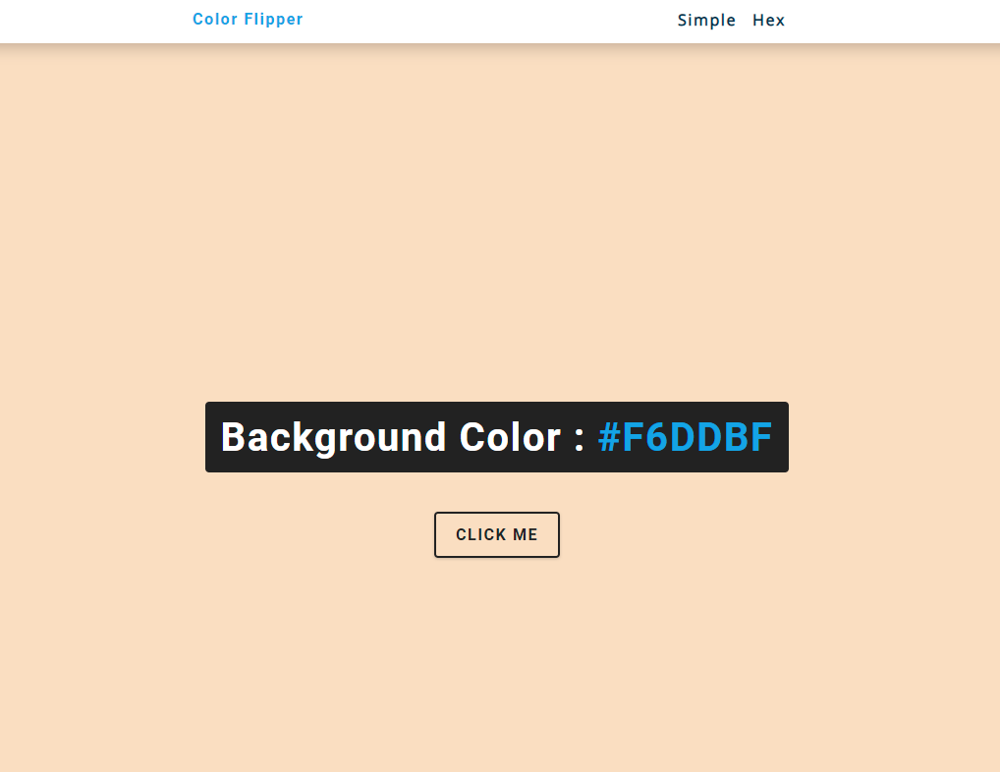

# JS - ColorFlipper

### This project has two parts:

---------

> In the first part user can have **red, green, blue and RGB** colors.

---------

---------

> In the second part user can have **HEX** colors.

---------

